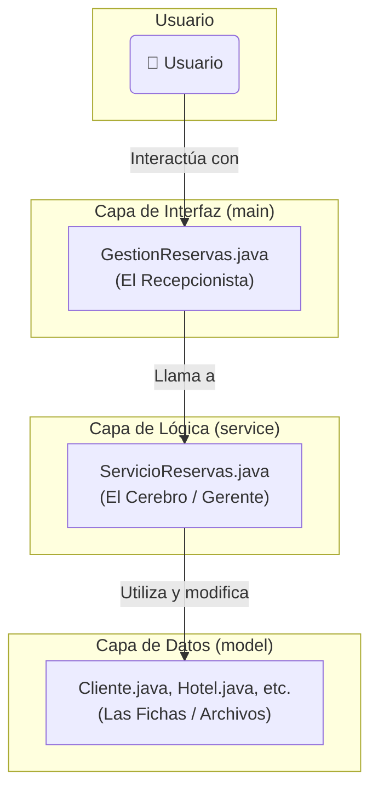

# Análisis del Funcionamiento: Sistema de Reservas de Hotel

¡Hola! Como tu ayudante, vamos a desglosar juntos la aplicación de reservas de hotel que hemos construido. El objetivo es que entiendas no solo **qué** hace el código, sino **por qué** está estructurado de esa manera y cómo cada pieza colabora para que todo funcione.

Usaremos la arquitectura de 3 capas como nuestro mapa para este recorrido.

---

## El Mapa de la Aplicación: Las 3 Capas

Nuestra aplicación está organizada en tres "departamentos" o capas. Esta separación (llamada **Separación de Responsabilidades**) es una de las prácticas más importantes en la programación profesional porque hace que el código sea más fácil de entender, mantener y mejorar.



1.  **`model` (El Almacén de Datos):** Aquí viven las "plantillas" de nuestros datos.
2.  **`service` (El Cerebro de Operaciones):** Aquí reside toda la lógica y las reglas de negocio.
3.  **`main` (La Interfaz de Usuario):** Esta es la única capa que habla con el usuario.

---

### Capa 1: Las Fichas de Información (Paquete `model`)

Imagina que este paquete es un archivador. Contiene las plantillas en blanco para toda la información que manejamos. Estas clases no *hacen* mucho por sí solas; su principal trabajo es *contener* datos de forma ordenada.

*   **`Habitacion.java`**: Es la ficha para una habitación. Guarda su número, su precio por noche y si está disponible (`true`/`false`).
*   **`Hotel.java`**: La ficha de un hotel. Contiene su ID, nombre y, lo más importante, una **lista de sus habitaciones**:
    ```java
    private ArrayList<Habitacion> habitaciones;
    ```
    Aquí usamos un **`ArrayList`** porque un hotel tiene una *lista* de habitaciones. Es nuestra "Lista de Compras" para las habitaciones de un hotel.
*   **`Cliente.java`**: La ficha para un cliente. Guarda su ID, nombre y su **historial de reservas**:
    ```java
    private ArrayList<Reserva> reservas;
    ```
    De nuevo, un **`ArrayList`** es perfecto. Mantiene un registro ordenado (cronológico) de las reservas que ha hecho el cliente.
*   **`Reserva.java`**: Esta es la ficha que conecta todo. Guarda qué `Cliente` reservó qué `Habitacion` en qué `Hotel`, la fecha y por cuántas noches.

---

### Capa 2: El Cerebro de la Operación (Paquete `service`)

Si el `model` es el archivador, el `service` es el gerente que sabe qué hacer con esos archivos. Aquí vive la clase más importante para la lógica:

*   **`ServicioReservas.java`**: Este es el cerebro. No habla con el usuario, pero ejecuta todas las tareas importantes. Su característica más distintiva es cómo almacena los datos principales:

    ```java
    private final Map<String, Hotel> hoteles = new HashMap<>();
    private final Map<String, Cliente> clientes = new HashMap<>();
    ```
    Aquí no usamos una lista, usamos un **`HashMap`**, nuestra "Agenda de Contactos". ¿Por qué? **¡Por velocidad!**

    **Visualizando la Diferencia de Búsqueda:**

    ```java
    // Alternativa LENTA con ArrayList (NO la usamos)
    // Para encontrar un hotel, debemos recorrer toda la lista.
    Hotel encontrarHotelEnLista(String id, ArrayList<Hotel> lista) {
        for (Hotel hotel : lista) {
            if (hotel.getIdHotel().equals(id)) {
                return hotel; // Encontrado, pero podría tardar mucho.
            }
        }
        return null; // No encontrado.
    }

    // Nuestra solución RÁPIDA con HashMap (SÍ la usamos)
    // Para encontrar un hotel, vamos directamente a él.
    Hotel encontrarHotelEnMapa(String id, HashMap<String, Hotel> mapa) {
        return mapa.get(id); // ¡Instantáneo!
    }
    ```
    *   **Reglas de Negocio:** También usamos el `HashMap` para aplicar reglas, como no permitir IDs duplicados. Antes de registrar un hotel, simplemente preguntamos `hoteles.containsKey("H5432")`. Si la respuesta es `true`, rechazamos la operación.

---

### Capa 3: El Recepcionista Amable (Paquete `main`)

Esta capa es la "cara" de nuestra aplicación. Es el único lugar donde interactuamos con el usuario final.

*   **`GestionReservas.java`**: Piensa en esta clase como el recepcionista del hotel.
    *   **Muestra el Menú:** Le presenta al usuario las opciones disponibles.
    *   **Toma Pedidos:** Usa un `Scanner` para leer lo que el usuario escribe en la consola.
    *   **Delega el Trabajo:** El recepcionista no hace el trabajo pesado. Llama al gerente: `servicio.registerHotel(id, nombre)`.
    *   **Comunica Resultados:** Recibe la respuesta del `servicio` y se la comunica al usuario.
    *   **Es a Prueba de Errores:** Utiliza un bloque `try-catch` para que, si el usuario introduce texto en lugar de un número, la aplicación no se rompa.

---

## Flujo Completo: Un Análisis Detallado

### El Camino Feliz: Creando una Reserva

Veamos cómo todas las capas y colecciones trabajan en equipo cuando el usuario elige la opción 6:

1.  **El Usuario Actúa:** El usuario ve el menú en la consola y escribe `6`.
2.  **El Recepcionista (`GestionReservas`) Atiende:** El método `createReserva()` pide al usuario el ID del cliente, del hotel, etc.
3.  **Llamada al Gerente (`ServicioReservas`):** `GestionReservas` delega la responsabilidad: `servicio.createReserva("C1", "H101", "202", 5);`.
4.  **El Cerebro (`ServicioReservas`) Procesa:**
    *   **Paso A: Validar.** Usa `clientes.get("C1")` y `hoteles.get("H101")` para encontrar los datos al instante.
    *   **Paso B: Ejecutar.** Si todo es válido, crea la `Reserva`, la añade al `ArrayList` del cliente (`cliente.getReservas().add(...)`) y actualiza la disponibilidad de la habitación.
    *   **Paso C: Informar.** Devuelve un mensaje de éxito: `"RESERVA_CREADA_EXITOSAMENTE"`.
5.  **El Recepcionista Comunica el Resultado:** `GestionReservas` recibe el mensaje y muestra en consola: "¡Reserva creada exitosamente!".

### ¿Y si algo sale mal? El Flujo de un Error

Ahora, imaginemos que el usuario intenta crear una reserva con un ID de cliente que no existe, como "C99".

1.  **El Usuario y el Recepcionista:** Los pasos 1, 2 y 3 son idénticos. `GestionReservas` llama a `servicio.createReserva("C99", "H101", ...);`.
2.  **El Cerebro (`ServicioReservas`) Detecta el Problema:**
    *   **Paso A: Validar Cliente.** El servicio intenta buscar al cliente con `clientes.get("C99")`. El `HashMap` busca instantáneamente y, como no encuentra la clave "C99", devuelve `null`.
    *   **Paso B: Detener y Notificar.** El servicio detecta que el cliente es `null` y detiene la operación inmediatamente. No continúa buscando el hotel ni la habitación. En su lugar, devuelve un código de error: `"ERROR_CLIENTE_NO_ENCONTRADO"`.
3.  **El Recepcionista (`GestionReservas`) Informa el Error:**
    *   `GestionReservas` recibe la respuesta `"ERROR_CLIENTE_NO_ENCONTRADO"`.
    *   En lugar de mostrar un mensaje de éxito, entra en la parte del `switch` que corresponde a ese error y muestra en consola: "Error: Cliente no encontrado.".
    *   El programa no se rompe. Simplemente informa el problema y vuelve a mostrar el menú, listo para otra operación.

Este flujo de error es fundamental y demuestra cómo la separación de capas permite manejar problemas de forma limpia y controlada.
