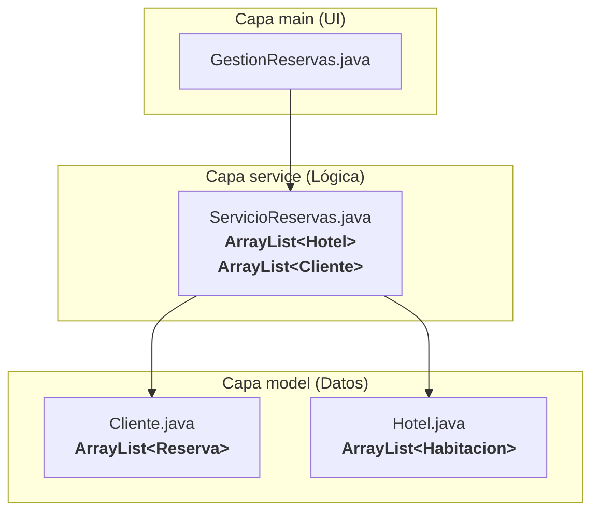

# Guía de Estudio: Análisis Profundo de `ArrayList` en Java
## Caso de Estudio: Sistema de Gestión de Reservas

¡Hola a todos! Hoy vamos a hacer una autopsia a una aplicación de reservas para entender a fondo una de las colecciones más comunes de Java: el **`ArrayList`**. Veremos dónde brilla y, más importante aún, dónde nos puede causar serios problemas de rendimiento.

---

## Parte 1: El Escenario - Una Aplicación construida solo con `ArrayList`

Nuestra aplicación de reservas está bien organizada en 3 capas, pero tiene una característica particular: usa `ArrayList` para **todo**.


Como vemos, tenemos `ArrayLists` en la capa de `model` (dentro de `Cliente` y `Hotel`) y, crucialmente, también en la capa de `service`. Vamos a analizar si esta es una buena idea en todos los casos.

---

## Parte 2: `ArrayList` - La Lista de Compras

*   **¿Qué es?** Una lista ordenada de elementos. Como una lista de compras, si añades "leche", luego "pan" y luego "huevos", ese es el orden en que estarán guardados.
*   **Fortaleza:** Mantiene el orden de inserción. Es muy fácil de usar y de recorrer de principio a fin.
*   **Debilidad Clave:** Para encontrar algo específico (ej. "¿apunté 'huevos'?"), tienes que empezar desde el primer ítem y revisar uno por uno hasta que lo encuentres o llegues al final.

#### **Métodos Comunes de `ArrayList` (Acciones con nuestra lista)**
*   **`add(elemento)`**
    *   **Analogía:** "Añadir un nuevo ítem al final de la lista de compras."
*   **`get(indice)`**
    *   **Analogía:** "Dame el tercer ítem de la lista de compras (recordando que empezamos a contar desde 0)."
*   **`remove(indice)`**
    *   **Analogía:** "Tachar un ítem de la lista de compras usando su posición."
*   **`size()`**
    *   **Analogía:** "¿Cuántos ítems tengo apuntados en la lista?"

---

## Parte 3: Analizando los Casos de Uso

Ahora, veamos cómo se usa `ArrayList` en las dos capas diferentes y decidamos si la elección fue correcta.

### Caso de Uso 1: Las Reservas de un Cliente (en la capa `model`)
*   **Implementación:** La clase `Cliente` tiene un `ArrayList<Reserva>`.
*   **Análisis:** Esta es una **excelente elección**.
    *   **¿Por qué?** Generalmente, un cliente tendrá un número relativamente pequeño de reservas (5, 10, quizás 20). Recorrer una lista tan corta para encontrar una reserva o simplemente para mostrarlas todas es muy rápido.
    *   Además, el orden es importante. Tiene sentido ver el historial de reservas de un cliente en el orden en que las hizo.
*   **Veredicto:** Uso correcto. `ArrayList` es perfecto para listas pequeñas donde el orden importa.

### Caso de Uso 2: Todos los Hoteles del Sistema (en la capa `service`)
*   **Implementación:** `ServicioReservas` tiene un `ArrayList<Hotel>`. Para encontrar un hotel por su ID, debe hacer un bucle `for` y revisar cada hotel hasta que el ID coincida.
    ```java
    // Dentro de ServicioReservas.java
    public Hotel findHotelById(String id) {
        for (Hotel hotel : hoteles) { // Recorre TODA la lista
            if (hotel.getIdHotel().equalsIgnoreCase(id)) {
                return hotel; // Lo encontré
            }
        }
        return null; // No estaba en la lista
    }
    ```
*   **Análisis:** Esta es una **mala elección de diseño**, y es la razón principal de esta ayudantía.
    *   **El Problema de la Escalabilidad:** Imaginen que tenemos 10 hoteles. El bucle `for` es casi instantáneo. Ahora, imaginen que somos una empresa exitosa con **10,000 hoteles**. Para encontrar el hotel que está al final de la lista, ¡el programa tiene que revisar los 9,999 anteriores primero! Cada búsqueda se vuelve increíblemente lenta. El programa no **escala**.
    *   **La Analogía:** Es como si el gerente de una empresa, para encontrar el teléfono de un empleado por su RUT, tuviera que leer **toda la guía telefónica de la ciudad desde la primera página** cada vez que necesita un número. ¡Es muy ineficiente!
*   **Veredicto:** Uso incorrecto para este caso. La velocidad de búsqueda es crítica, y `ArrayList` es la herramienta equivocada para búsquedas rápidas en grandes conjuntos de datos.

---

## Parte 4: El Flujo Lento de una Reserva

Veamos el impacto de esta decisión de diseño en el flujo de trabajo:

1.  **`GestionReservas`** pide los datos y llama a `servicio.createReserva("C1", "H9876", ...)`
2.  **`ServicioReservas`** recibe la petición.
3.  **Búsqueda Lenta (Hoteles):** Inicia un bucle `for` sobre el `ArrayList` de 10,000 hoteles. Compara el ID de cada hotel con "H9876". Este paso puede tardar mucho tiempo.
4.  **Búsqueda Lenta (Clientes):** Inicia otro bucle `for` sobre el `ArrayList` de, digamos, 50,000 clientes para encontrar "C1".
5.  Si finalmente los encuentra, crea la reserva y la añade con `add()` al `ArrayList` del cliente (esta parte, añadir al final, es rápida).
6.  **Conclusión:** La ineficiencia en la capa de servicio, causada por una mala elección de la estructura de datos, hace que toda la aplicación se sienta lenta y poco profesional a medida que crecen los datos.

---

## Parte 5: Preguntas para Reflexionar (¡Discusión!)

Parte 5: Preguntas para Reflexionar (¡Discusión!)

   1. Explicación: Añadir un elemento al final de un ArrayList con add() es muy rápido porque es como añadir un ítem al final de tu lista de compras; no 
      necesitas reorganizar nada. Nueva Pregunta: ¿Qué crees que pasaría con el rendimiento si en lugar de añadir al final, intentáramos insertar un nuevo 
      elemento en la primera posición de una lista con millones de ítems? (Pista: ¿qué habría que hacer con todos los demás elementos?).

       * Respuesta: Sería muy lento. Para insertar al principio, el ArrayList debe desplazar todos los demás millones de elementos un espacio hacia la 
         derecha para hacer sitio, lo cual es una operación muy costosa.

   2. Si `ServicioReservas` es tan lento, ¿por qué el programa "funciona" bien cuando lo probamos con 3 o 4 hoteles? ¿Qué nos enseña esto sobre la importancia 
      de pensar en el futuro (escalabilidad) y probar con grandes volúmenes de datos?

       * Respuesta: Porque con pocos datos, la ineficiencia es imperceptible. Esto nos enseña que el software debe ser escalable; es decir, debe seguir 
         siendo rápido incluso cuando la cantidad de datos crece masivamente. Probar con muchos datos es crucial para encontrar estos problemas de 
         rendimiento.

   3. El Desafío: Si ArrayList es la herramienta incorrecta para el ServicioReservas, ¿qué otra colección de Java conocen que sea como una "agenda de 
      contactos" o un "índice de un libro" y que nos permitiría buscar por ID de forma instantánea?

       * Respuesta: Un `HashMap`. Almacena los datos como pares clave-valor (ej. ID del hotel -> Objeto Hotel) y permite un acceso directo e instantáneo a 
         cualquier elemento si conoces su clave.

